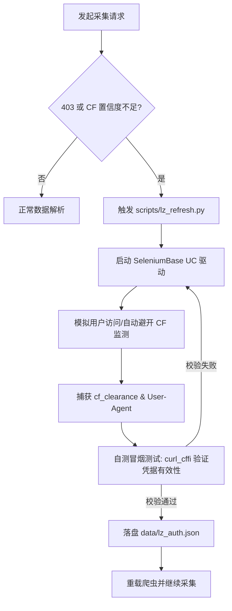

# Cloudflare 挑战绕过技术指南 (SeleniumBase UC 专题)

## 0. 背景与目标
在针对 **LeakedZone** 或其他受 **Cloudflare (CF)** 保护的站点进行高频自动化采集时，最常见的阻碍是“五秒盾”（Turnstile 或 Managed Challenge）。传统的 `requests` 或 `httpx` 会直接触发 403 错误。

本方案旨在描述如何通过 **SeleniumBase (UC Mode)** 结合 **curl_cffi**，实现一套可在 **Windows 桌面**与 **GitHub Actions (GHA)** 等无头 Linux 环境下稳定运行的全自动过盾闭环。

---

## 1. 核心技术栈
- **SeleniumBase (UC Mode)**: 用于模拟真实用户指纹，自动绕过各种 Headless 检测，并通过“智能点击”通过 CF 验证。
- **curl_cffi (AsyncSession)**: 在获取到凭据后，通过 TLS 指纹伪装（Impersonate）模拟特定浏览器的底层握手，以极低开销进行大规模 API 采集。
- **Impersonate 技术**: 确保浏览器端的 TLS 指纹与脚本端的 TLS 指纹像素级对齐（如 Chrome 110/120）。

---

## 2. 自动化流程架构


---

## 3. 关键加固要点

### 3.1 UC Mode 的黑魔法
SeleniumBase 的 `undetected-chromedriver` (UC) 模式是通过移除常规 WebDriver 的特征（如 `navigator.webdriver` 等标识）来实现的。
- **核心逻辑**: 在页面加载前动态执行 CDP 命令，抹除驱动指纹。
- **本项实践**: 针对 Cloudflare，我们开启了 `uc` 模式，并结合随机休眠与特定的 UA 捕获 logic。

### 3.2 TLS 指纹自适应 (GHA 专项)
这是解决 **GitHub Actions 容易被封杀** 的核心方案。
- **问题**: GHA 运行在 Linux Server 环境，默认 TLS 握手特征与 Windows Chrome 极其不同。
- **方案**:
    1. 在 Linux 环境下，强制 `curl_cffi` 使用 `chrome110` 指纹，并对齐 `Sec-Ch-Ua-Platform` 等现代 Header。
    2. 将 `lz_refresh.py` 捕获的 UA 与爬虫端的 `impersonate` 策略进行严格绑定。

### 3.3 过盾后的“冒烟测试” (Smoke Test)
为了防止“浏览器虽然过了，但脚本依然 403”的衔接断层，我们在刷新脚本中引入了：
```python
# 冒烟测试：确保 Cookie 在 curl_cffi 下也真实有效
test_res = curl_requests.get(target_url, cookies=cookie_dict, impersonate="chrome120")
if test_res.status_code == 200:
    save_auth() # 只有测试通过才持久化存储
```

---

## 4. 环境配置指引

### 4.1 核心依赖
```bash
pip install seleniumbase curl_cffi python-dotenv
```

### 4.2 Linux/GHA 环境特殊配置
在 GHA 中运行需要确保安装了 Chrome 浏览器，并在代码中处理：
- `xvfb`: 虚拟显示屏支持。
- `headless`: UC 模式在 Linux 下建议配合特定驱动参数启动。

---

## 5. 常见 Q&A
- **Q**: 为什么获取到了 `cf_clearance` 依然 403？
- **A**: 通常是因为 **UA 与 TLS 指纹不匹配**。CF 会验证你的 `cf_clearance` 颁发时的 UA 是否与当前请求的 UA 一致，且 TLS 握手包是否匹配。

- **Q**: 代理服务器会有影响吗？
- **A**: 强烈建议在刷新和采集时使用相同的代理 IP，否则极大几率触发二次挑战。

---

## 6. 开发者维护
相关核心代码见：
- [lz_refresh.py](file:///d:/safePro/Puser_se/onlyfans-bot/OnlyFans-Bot/scripts/lz_refresh.py): 过盾与验证。
- [leakedzone.py](file:///d:/safePro/Puser_se/onlyfans-bot/OnlyFans-Bot/crawlers/leakedzone.py): 凭据消费与指纹对齐。

---
*Generated by OnlyFans-Bot Documentation Team.*
